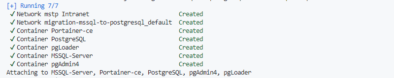
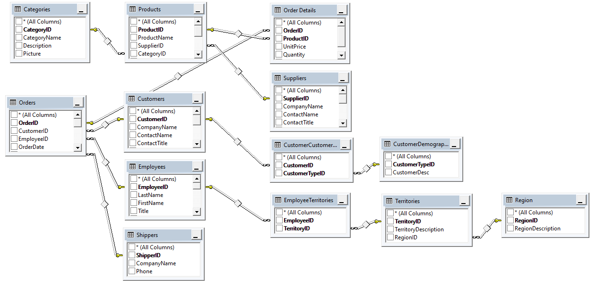
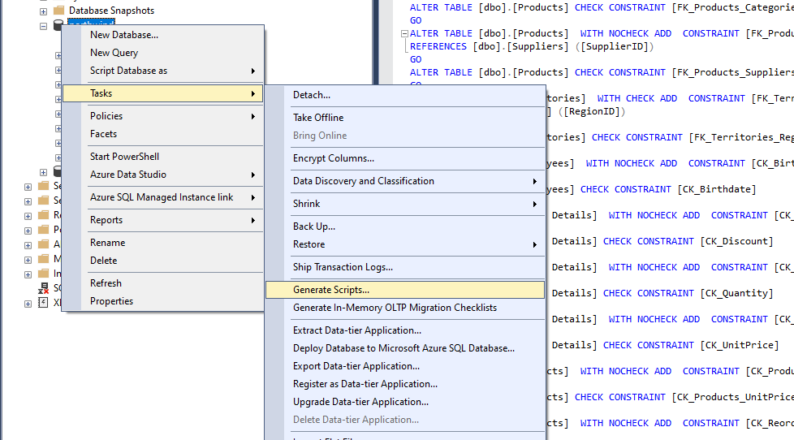
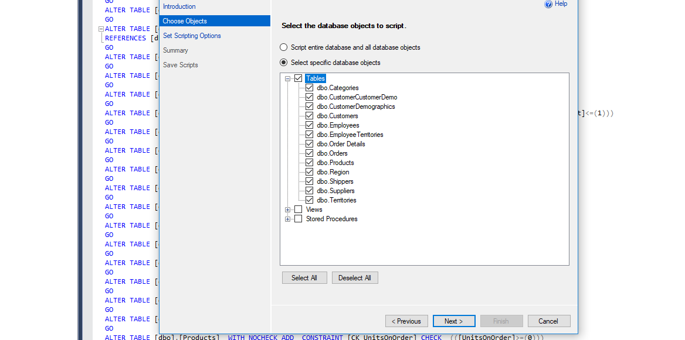
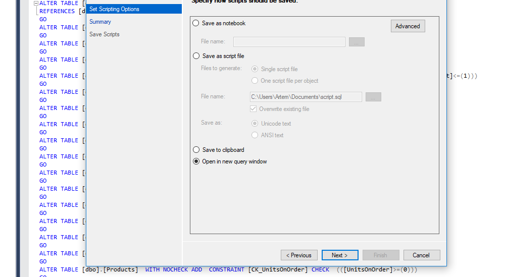
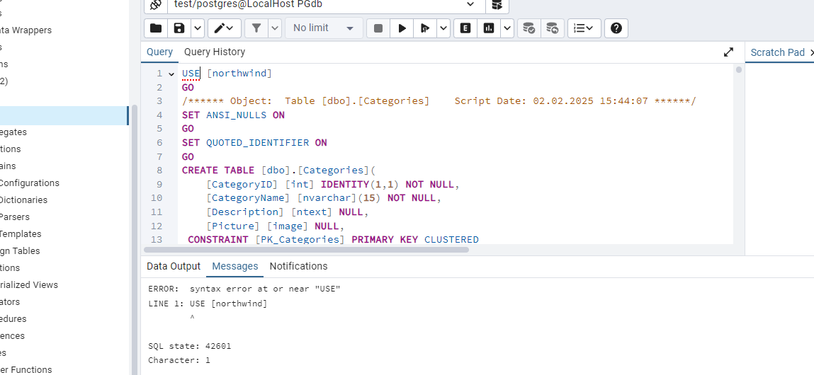
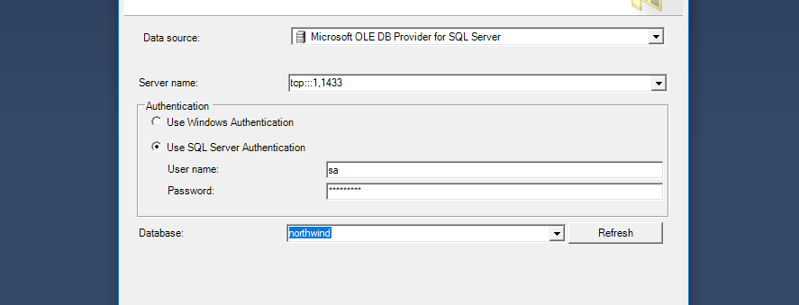
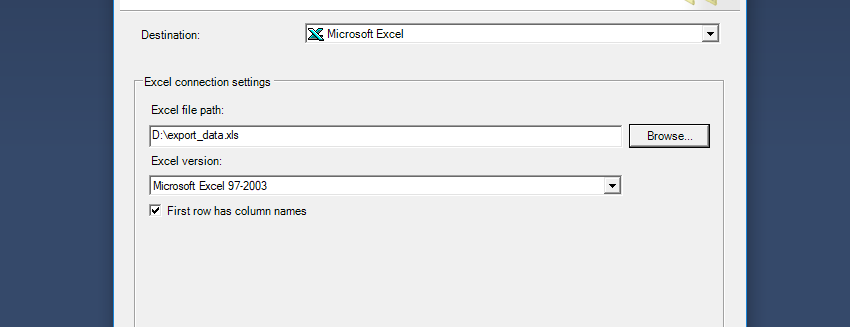
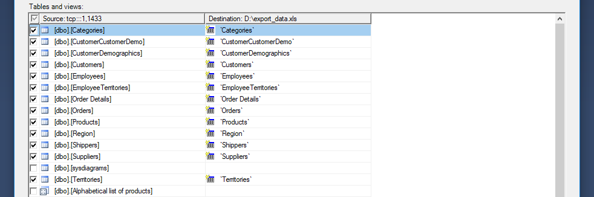
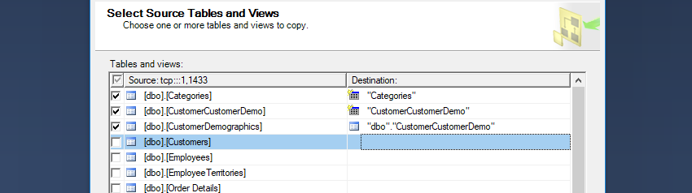

Миграция базы данных (БД) из MS SQL в PostgreSQL может быть довольно сложной задачей, так как эти две системы управления базами данных (СУБД) имеют различную синтаксическую и структурную конструкцию запросов. Однако, существуют инструменты, которые позволяют автоматизировать процесс миграции и значительно облегчить работу над ней.

В данной статье рассмотрим как с помощью SQL Server Management Studio (SSMS) провести миграцию данных.

> Продолжение цикла статей о миграции с MSSQL на PostgreSQL. Ознакомиться с предидущими частями можно тут:
> - [Миграция с MSSQL на PostgreSQL: Часть 1. Теория](https://devmemo.ru/posts/migraciya-s-mssql-na-postgresql-chast-1-teoriya/)

## Подготовка
Для того чтобы приступить к процессу миграции данных из MS SQL в PostgreSQL, необходимо подготовить «рабочую площадку». Разворачивать «рабочую площадку» будем в Docker, подготовил проект на GitHub:
::github{repo="asplekhanov/migration-mssql-to-postgresql"}

Состав набора:
- Portainer-ce: 2.25.1
- PostgreSQL: 17.2
- pgAdmin4: 8.14
- MSSQL Server: 2019-latest
- Database examples

Так же необходимо скачать SSMS и PostgreSQL ODBC Driver:
- [SQL Server Management Studio / Microsoft Learn](https://learn.microsoft.com/ru-ru/sql/ssms/download-sql-server-management-studio-ssms)
- [PostgreSQL ODBC Driver / www.postgresql.org](https://www.postgresql.org/ftp/odbc/releases/)

:::TIP[Важно]
В качестве целевой БД буду использовать пример БД от Microsoft - [Northwind / github.com](https://github.com/Microsoft/sql-server-samples/tree/master/samples/databases/northwind-pubs).
:::

### Установка и настройка
1. Клонируем репозиторий:
```bash
git clone https://github.com/asplekhanov/migration-mssql-to-postgresql.git
```
2. Создаем тома для хранения данных контейнеров:
```bash
docker volume create --name Portainer-ce
docker volume create --name PostgreSQL
docker volume create --name pgAdmin4
docker volume create --name MSSQL-System
docker volume create --name MSSQL-Users
```
3. Запускаем контейнеры:
```bash
docker-compose up
```
Если все сделано правильно получим следующее сообщение:


4. Скачиваем и устанавливаем SQL Server Management Studio - [SSMS / Microsoft Learn](https://learn.microsoft.com/ru-ru/sql/ssms/download-sql-server-management-studio-ssms)
5. Скачиваем и устанавливаем PostgreSQL ODBC Driver - [Driver / www.postgresql.org](https://www.postgresql.org/ftp/odbc/releases/)
6. Копируем целевую базу в контейнер MSSQL-Server:
    1. Открываем SQL Server Management Studio.
    2. В окне "Connect to Server" вводим/выбираем:
        - **Server type**: Database Engine
        - **Server name**: tcp:::1,1433
        - **Authentication**: SQL Server Authentication
        - **Login**: username
        - **Password**: passwd
    3. Создаем новую базу данных:
        - **Name**: northwind
        - **Collatiion**: Cyrillic_General_CI_AS
    4. Открываем скрипт `instnwnd.sql` в новом окне запроса.
    5. Запускаем скрипт.
7. Создаем базу данных в PostgreSQL:
    1. Открываем pgAdmin4: [localhost:80](http://localhost:80)
    2. Создаем новое подключение к БД:
        - **Name**: pgdb
        - **Host name/address**: pgdb
        - **Username**: username
        - **Password**: passwd
    3. Создаем новую базу данных:
        - **Database**: northwind
        - **Encoding**: UTF8

На этом подготовка "рабочей площадки" завершена.

## Этап 1. Анализ текущей базы данных
Перед началом миграции необходимо провести инвентаризацию всех объектов базы данных, включая таблицы, индексы, хранимые процедуры и триггеры. Также необходимо оценить, сколько данных необходимо перенести, это необходимо для проверки полноты перенесенной информации.

:::TIP[Важно]
Чтобы не растягивать статью, проведем инвентаризацию таблиц и их ключей.
:::

### Таблицы


Всего в БД Northwind 13 таблиц:
| Таблица              | Колнки                                                                                                                             | Ключ                                  | Кол-во строк |
|----------------------|------------------------------------------------------------------------------------------------------------------------------------|---------------------------------------|--------------|
| Categories           | CategoryID, CategoryName, Description, Picture                                                                                     | CategoryID                            | 8            |
| CustomerCustomerDemo | CustomerID, CustomerTypeID                                                                                                         | CustomerID, CustomerTypeID            | 0            |
| CustomerDemographics | CustomerTypeID, CustomerDesc                                                                                                       | CustomerTypeID                        | 0            |
| Customers            | CustomerID, CompanyName, ContactName, ContactTitle, Address, City, Region, PostalCode, Country, Phone, Fax                         | CustomerID                            | 91           |
| Employees            | EmployeeID, LastName, FirstName, Title, TitleOfCourtesy, BirthDate, HireDate, Address, City, Region, PostalCode, Country, HomePhone, Extension, Photo, Notes, ReportsTo, PhotoPath | EmployeeID | 9 |
| EmployeeTerritories  | EmployeeID, TerritoryID                                                                                                            | EmployeeID, TerritoryID               | 49           |
| Order Details        | OrderID, ProductID, UnitPrice, Quantity, Discount                                                                                  | OrderID, ProductID                    | 2155         |
| Orders               | OrderID, CustomerID, EmployeeID, OrderDate, RequiredDate, ShippedDate, ShipVia, Freight, ShipName, ShipAddress, ShipCity, ShipRegion, ShipPostalCode, ShipCountry | OrderID | 830 |
| Products             | ProductID, ProductName, SupplierID, CategoryID, QuantityPerUnit, UnitPrice, UnitsInStock, UnitsOnOrder, ReorderLevel, Discontinued | ProductID                             | 77           |
| Region               | RegionID, RegionDescription                                                                                                        | RegionID                              | 4            |
| Shippers             | ShipperID, CompanyName, Phone                                                                                                      | ShipperID                             | 3            |
| Suppliers            | SupplierID, CompanyName, ContactName, ContactTitle, Address, City, Region, PostalCode, Country, Phone, Fax, HomePage               | SupplierID                            | 29           |
| Territories          | TerritoryID, TerritoryDescription, RegionID                                                                                        | TerritoryID                           | 53           |

**Итого: 13 таблиц, 3308 строк.**

## Этап 2. Создание схемы базы данных в PostgreSQL
Переведите структуру таблиц из MSSQL в PostgreSQL, учитывая различия в синтаксисе. Адаптируйте индексы, ограничения и связи. Воспользуемся функционалом SSMS и создадим SQL-запрос на создание таблиц БД:
1. Выберите БД, в контекстном меню выберите `Tasks`->`Generate Scripts...`.

2. Выберите все таблицы (без views и stored).

3. Далее выбираем пункт "Open in new query window".


В результате получим готовый SQL-запрос на создание структуры БД, останется скорректировать под синтаксис PostgreSQL. Для удобства отладки создаем пустую БД в PostgreSQL, в pgAdmin4 открываем `Query Tool`, вставляем SQL-запрос из SSMS.


:::NOTE[SQLines SQL Converter]
Для конвертации SQL запроса из MSSQL можно воспользовотся [SQLines SQL Converter Online](https://www.sqlines.com/online)
:::

## Этап 3. Экспорт данных из MS SQL в PostgreSQL
Если в базе данных пока не много данных, то можно провести экспорт данных через **csv**. Данный вариант удобен тем, что данные можно легко корректировать, если при импорте в PostgreSQL выдаст ошибку. В противном случае используем установленный ранее драйвер данных для SSMS.

### Экспорт через CSV
В SSMS выполним следующие действия:
1. Выберите БД, в контекстном меню выберите `Tasks`->`Export Data...`.
2. В качестве Data source выбираем `Microsoft OLE DB Provider for SQL Server`. Используем аутентификацию SQL.

3. В качестве Destination выбираем `Microsoft Excel`. Создаем пустой Excel и указываем его в **Excel file path**.

4. Далее выбираем данные для экспорта.


:::NOTE[Важно]
Если при экспорте возникает ошибка связанная с Long данными, то необходимо игнорировать данные поля и переносить их вручную.
:::

После успешного экспорта получаем Excel с данными из БД. Каждая таблица из БД - отдельный лист в Excel. Теперь необходимо сохранить каждый лист в формат csv.

Импорт в данны PostgerSQL с помощью pgAdmin4:
1. Подключаемся к целевой БД.
2. Выбирем таблицу для импорта данных.
3. В контекстном меню выбирем **Import/Export Data...**.
4. Указываем файл с данными выбраной таблицы, указываем формат csv. На вкладке **Options** указываем:
    - Header - true
    - Delimiter - ;
5. Повторяем пункты 2-4 для оставшихся таблиц.

### Экспорт через SSMS
В SSMS выполним следующие действия:
1. Выберите БД, в контекстном меню выберите `Tasks`->`Export Data...`.
2. В качестве Data source выбираем `Microsoft OLE DB Provider for SQL Server`. Используем аутентификацию SQL.

3. В качестве Destination выбираем `.Net Framework Data Provider for Odbc`:
    - ConnectionString:
    ```
    Driver={PostgreSQL Unicode};server=localhost;port=5432;database=northwind;uid=username;pwd=passwd
    ```
4. Выбираем `Copy data from one or more tables or views`.
5. В левом столбце выбираем таблицу/ы исходной БД, в правом столбце указываем таблицу/ы в целевой БД.

6. Запускаем процесс копирования данных, если ранее таблицы и данные в них были подготовлены к переходу в PostgreSQL, то получим сообщения об успешном копировании данных.


## Заключение
В целом, миграция базы данных из MS SQL в PostgreSQL с помощью SSMS и других инструментов может быть эффективным способом переноса данных из одной системы управления базами данных в другую. Однако перед началом миграции необходимо тщательно спланировать процесс и выбрать наиболее подходящие инструменты для конкретной ситуации.

## Полезные ссылки по теме
- [SQL Sample Database / zentut](https://www.zentut.com/sql-tutorial/sql-sample-database/)
- [Мигрируем с SQL Server на PostgreSQL двумя способами / Хабр](https://habr.com/ru/companies/otus/articles/802827/)
- [Get the sample databases for ADO.NET code samples / Microsoft Learn](https://learn.microsoft.com/en-us/dotnet/framework/data/adonet/sql/linq/downloading-sample-databases)
- [SQLines SQL Converter Online](https://www.sqlines.com/online)
